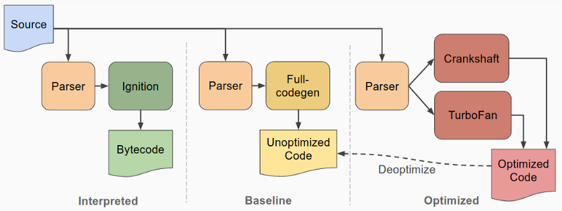
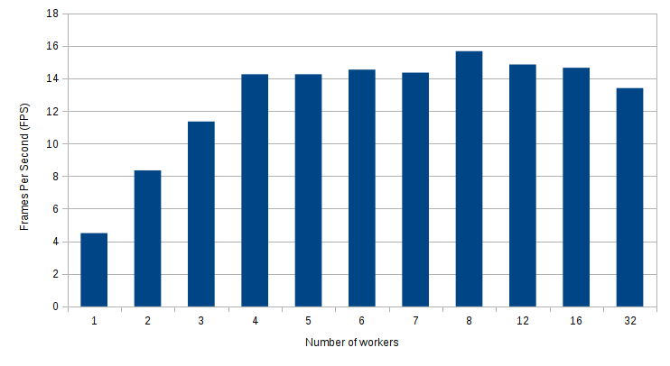
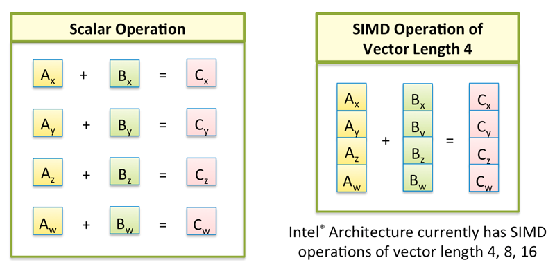

:data-transition-duration: 400
:author: Simon Werner
:skip-help: false
:css: style.css

.. title:: High Perf Node.js
.. note::
    - Preparation:
        - Network

----

Optimising Node.js for Speed
============================

----

DISCLAIMER #1
=============

|

- Optimising is bad for your health
- Don't try this at home children
- Don't believe what I say
- Don't write a RayTracer in JavaScript
- Poor performace ``!==`` bad programming

----

DISCLAIMER #2
=============

|

**Don't make assumptions**

----

DISCLAIMER #3
=============

|

Donald Knuth:

    *premature optimization is the root of all evil.*

----

Optimising Node.js for Speed
============================

#. WTF is RayTracing?
#. The Optimisation Process
#. Benchmarking and Profiling
#. Understand the compiler
#. Multi-threading
#. Node-gyp
#. Upcoming JavaScript Features

----

WTF is RayTracing?
==================

.. image:: Ray-tracedVsRasterized.jpg

----

WTF is RayTracing?
==================

- Photo realistic scenes
- Highly mathematical
- Computationally intensive
- Not your standard Node.js process
- The `un-optimised <http://rtjsrt.s3-website-ap-southeast-2.amazonaws.com/v1-updated-vector/>`_ RayTracer

----

The Optimisation Process
========================

----

The Optimisation Process
========================

#. Start with clean code
#. Test using a benchmark / profiler
#. Identify the bottleneck
#. Update the code
#. Repeat steps 2. to 5.
#. STOP

----

Benchmarking and Profiling
==========================

----

Benchmarking vs Profiling
=========================

|

**Profiling**

- Looks at whole application workflow
- Used to find bottle necks

|

**Benchmark**

    #. measure performance (before)
    #. improve code
    #. measure performance (after)

----

Benchmarking with Simple Timers
===============================

|

.. code:: javascript

    const start = new Date.getTime();

    // ... your slow code ...

    const end = new Date.getTime();
    console.log(`Time taken (ms): ${end - start}`);

    // Time taken (ms): 1245

----

``performance.now()``
======================

- native in browser
- npm `package <https://www.npmjs.com/package/performance-now>`_ for Node.js

----

The V8 profiler
===============

|

V8 comes with built-in profiler:

.. code:: javascript

    const profiler = require('v8-profiler');

    if (startProfiling === true) {
        profiler.startProfiling();
    }

    // ... let code run for a few seconds/minutes

    if (stopProfiling === true) {
        profiler.stopProfiling()
                .export(function exportFunction(err, res) {
                    const fs = require('fs');
                    fs.writeFileSync('app.cpuprofile', res);
                });
    }

----

The V8 profiler
===============

Open in Chrome developer tools

.. image:: devTools.png
   :width: 960px

----

Improving ``.dot()``:
=====================

|

.. code:: javascript

    // Before - slow
    function dot(v, w) {
        return (v[0] * w[0] + v[1] * w[1] + v[2] * w[2]);
    }

    // After - 2x times faster
    Vector.prototype.dot = function(w) {
        return this.x * w.x + this.y * w.y + this.z * w.z;
    };

----

Other profiling tools
=====================

Comprehensive suites (client to db):

- New Relic
- AppDynamics
- Dynatrace

Low level:

- `IRHydra² <http://mrale.ph/irhydra/2/>`_ - shows generated assembly code
- Linux Kernel (perf, dtrace, etc)

----

Understand the compiler
=======================

----

Understand the compiler
=======================

|

.. image:: Compiler.png
   :width: 960px

----

The current V8 compiler
=======================

|
|
|
|
|

----

The current V8 compiler
=======================

The future V8 compiler
======================

.. image:: FutureV8.png
   :width: 960px

----

ES6 + New Features
==================

- ``let``, ``const`` slower than ``var``
- new JavaScript features tend to be slow

----

JSPerf.com
==========

- Benchmark code snippets
- Performance quirks
- Some tests are very poorly written

----

Avoid hidden classes
====================

Keep to the original definition, if you can.

.. code:: javascript

    fuction vector(x, y) {
        this.x = x;
        this.y = y;
    }

    const a = new vector(1, 2);
    const b = new vector(3, 4); // OKAY: b has the same hidden class as a
    b.z = 5;                    // BAD: b now has a different hidden class

----

Avoid polymorphic classes
=========================

Difficult for compiler to optimise.

.. code:: javascript

    function add(a, b)         return a + b;
    }
    add(1, 2);      // OKAY: Starts as monomorphic
    add(2, 3);      // OKAY: Still monomorphic
    add('x', 'y');  // BAD: Now becomes polymorphic

`jsperf.com/monomorphism-vs-polymorphism/3 <https://jsperf.com/monomorphism-vs-polymorphism/3>`_

----

Avoid Factory Functions
=======================

.. code:: javascript

    function createValueObject() {
        var x = 0;

        function get() {
            return x;
        }

        function add(y) {
            x += y;
        }

        return {
            get: get,
            add: add,
        };
    }

`jsperf.com/prototype-vs-factory-vs-class <https://jsperf.com/prototype-vs-factory-vs-class>`_

----

forEach vs for
==============

.. code:: javascript

    values.forEach(add);

    // vs

    for (i = 0; i < values.length; i++) {
        add(values[i]);
    }

`jsperf.com/for-vs-foreach <https://jsperf.com/for-vs-foreach>`_

----

Multi-threading
===============

----

Multi-threading in Node.js
==========================

- By default JavaScript is single threaded
- Multi-threading:

   - Browser: Web Workers
   - Node.js: Cluster (native)
   - npm library: ``workerjs``

----

Master / Worker
===============

|

``master.js``:

.. code:: javascript

    const Worker = require('workerjs');
    const worker1 = new Worker('myWorker.js');

    worker1.addEventListener('message',
                (workerMsg) ==> {
                    // ... do something with the result
                });

    worker1.postMessage('Start your work');

----

``myWorker.js``:

.. code:: javascript

    this.addEventListener('message', function(e) {

        if (e.message === 'Start your work') {

            // Do lots of work
            const result = rayTrace();

            this.postMessage(result);
        }

    }, false);

----

Multi-threading results
=======================

|

`RayTracer <http://rtjsrt.s3-website-ap-southeast-2.amazonaws.com/v3-final/>`_

----

node-gyp
========

----

node-gyp
========

|

- Binds C++ to V8
- Used to develop core Node.js modules
- Many npm libraries use it
- Can use for:

  - binding to external libraries
  - performance improvements

----

node-gyp - drawbacks
====================

|

- Need to know C++
- Significant effort for writing C++/JS interface
- May need to maintain 2 code bases
- Need to unpack and pack values

----

Let's write this in C++
=======================

|

.. code:: javascript

    module.exports.hello = () => 'world';

----

File structure
==============

|

``\addon.cc``

``\bindings.gyp``

``\hello.js``

``\build\``

----

``addon.cc``:

.. code:: Cpp

    #include <node.h>

    namespace demo {

    using v8::FunctionCallbackInfo;
    using v8::Isolate;
    using v8::Local;
    using v8::Object;
    using v8::String;
    using v8::Value;

    void Method(const FunctionCallbackInfo<Value>& args) {
      Isolate* isolate = args.GetIsolate();
      args.GetReturnValue().Set(String::NewFromUtf8(isolate, "world"));
    }

    void init(Local<Object> exports) {
      NODE_SET_METHOD(exports, "hello", Method);
    }

    NODE_MODULE(addon, init)

    }  // namespace demo

----

``binding.gyp``:

|

.. code:: javascript

    {
      "targets": [
        {
          "target_name": "addon",
          "sources": [ "addon.cc" ]
        }
      ]
    }

----

``hello.js``:

|

.. code:: javascript

    const addon = require('./build/Release/addon');

    console.log(addon.hello());    // "world"

----

Upcoming Features
=================

----

SIMD
====

|

Single Instruction Multiple Data

----

.. code:: javascript

    // Classic method
    Vector.prototype.add = function(w) {
        this.x += w.x;
        this.y += w.y;
        this.z += w.z;
    };

    // SIMD
    Vector.prototype.add = function(w) {
        this.v = this.v.add(w);
    };

----

Very slow in V8, currently.

`SIMD example <http://peterjensen.github.io/mandelbrot/js/mandelbrot-ww-asm.html>`_

----

Links
=====

https://medium.com/@psiphi75/optimising-node-js-for-speed-part-1-19d72a085aba

https://medium.com/@psiphi75/optimising-node-js-for-speed-part-2-56e304bdc50f

https://medium.com/@psiphi75/optimising-node-js-for-speed-part-3-aebd1c37fe6c

https://github.com/psiphi75/rtjsrt

----

Thanks
======
